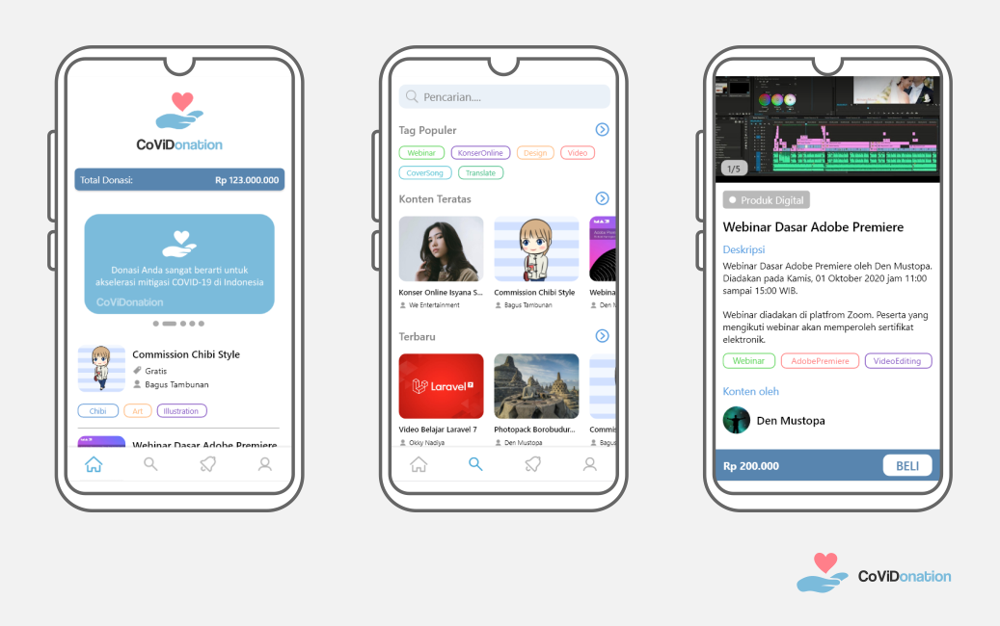
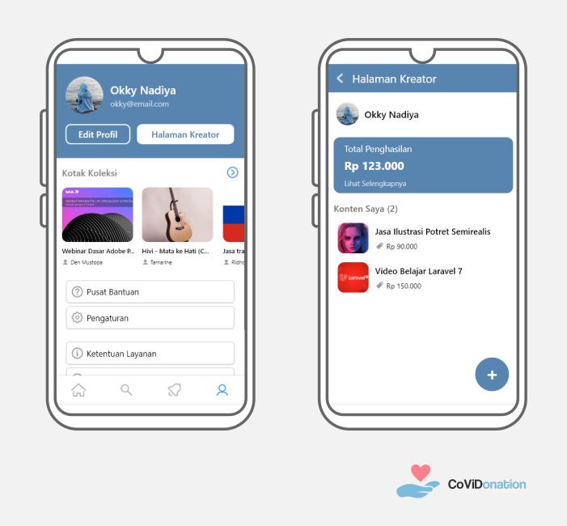

# CoViDonation

### About
CoViDonation, is a digital content marketplace platform that aims to collect donations to accelerate COVID-19 mitigation in Indonesia.

Build with:
  - UI/UX: Adobe XD
  - Front End: React Native
  - Back End: Firebase

### Contributors
CoViDonation was developed from the work of a team of 5 students from the University of North Sumatra:
  - 171402150 Ariel Febrian (Team Leader)
  - 171402036 Ari Rahmansyah Putra
  - 171402039 Okky Nadiya
  - 171402054 Arya Pratama
  - 171402090 Muhammad Bagus Syahputra Tambunan

### Requires
  - Node.js
  - NPM (Node Package Manager)
  - Android emulator

### Prototype
>http://bit.ly/covidonation

### Screenshots

 

### How to use
Get the code:
>git clone https://github.com/skl98/Covidonation.git

Fetch dependencies:
>npm install

Start React-Native server:
>npx react-native start

Run on an Android emulator or Android device:
>npx react-native run-android

